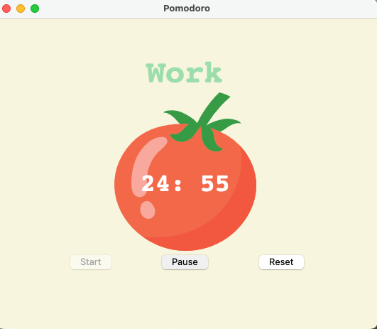
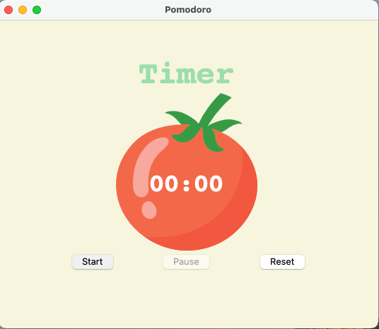
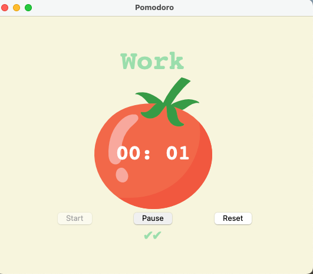
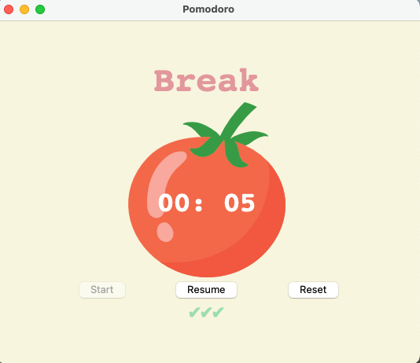
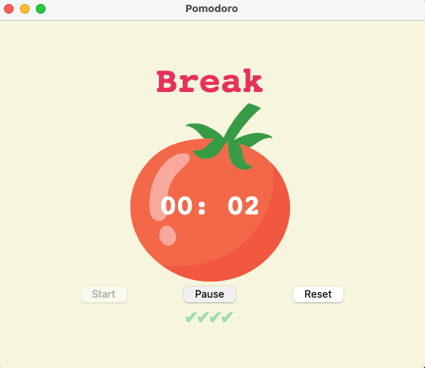

# tkinter-pomodoro-app
Simple Pomodoro App using Tkinter library

## Overview
The Pomodoro Technique is a productivity technique that involves working in 25-minute time increments with short breaks in between. The technique is named after the tomato-shaped timer that was first used to test it. The idea is that the timer instills a sense of urgency, so you know you only have 25 minutes to make as much progress on a task as possible.

This is a simple python app built using tkinter library which allows you to start a pomodoro timer.

## Explanation of the UI
The UI consists of a tomato shaped timer with a Start, Pause/Resume and Reset Button. The button functionality is explained below:

- Start Button: To start the timer
- Pause Button: To pause the timer once started
- Resume Button: To resume the timer if it was paused
- Reset Button: To reset the progress

Pomodoro timer has a Work session of 25 minutes, a Short Break session of 5 minutes after each work session and a Long Break session of 20 minutes after 4 consecutive work intervals.

Each work interval will render a green check mark to indicate the number of work intervals completed.

## UI 
### Start

### Reset

### Pause and Resume

### Work Session

### Short Break Sesssion

### Long Break Session

